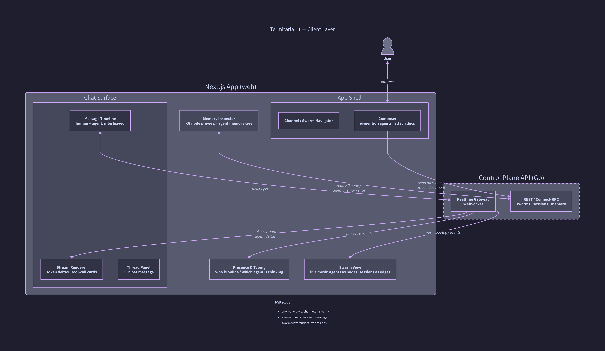
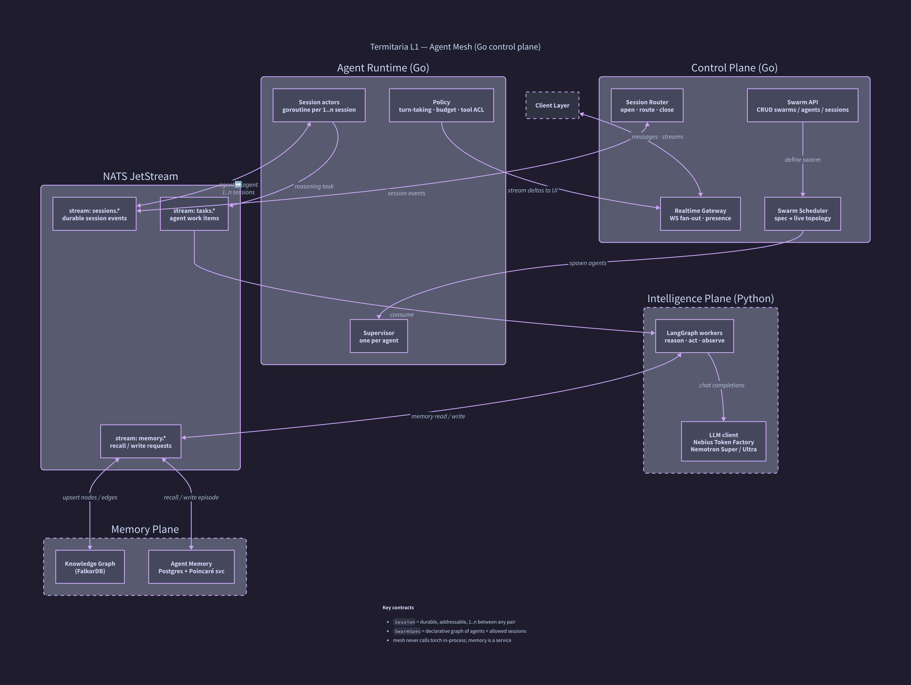
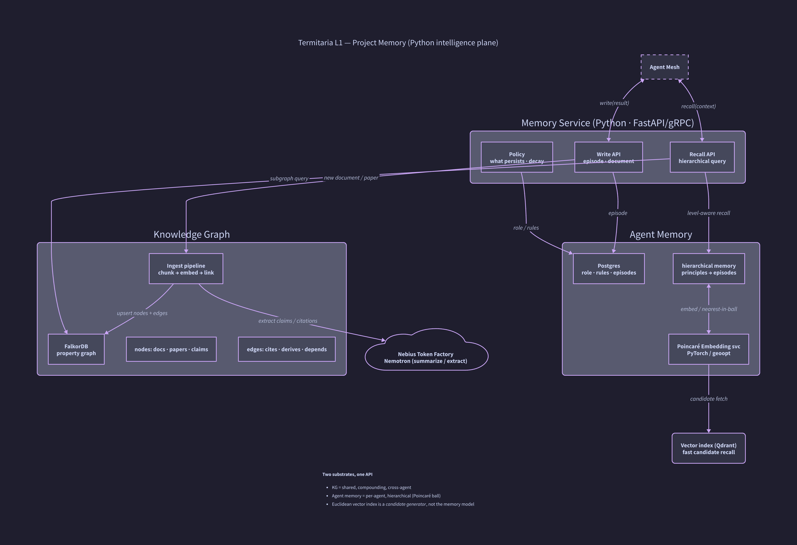

# Termitaria 架构文档（L1）

> 目标：一个高度可定制的 multi-agent harness。Go 控制面 + Python 智能面。
> 本文档是 L1：描述各平面的组件、契约与数据流。L2（模块内部实现）不在此列。
>
> 赛事：Nebius × NVIDIA Global AI Hackathon（Best Apps & Agents 方向）。架构为 **Nebius Token Factory** 与 **NVIDIA Nemotron** 预留了明确的集成点，见 [§7](#7-hackathon-集成点)。

---

## 0. 设计约束（从问题反推）

| 约束 | 来源 | 对架构的要求 |
| --- | --- | --- |
| 复杂智力工作由「专门角色 + 共享上下文」完成 | `background.md` | agent 必须有独立 role/rules/memory，且能两两开多条 session |
| 协作是 mesh，不是线性聊天 | `background.md` | 会话是一等公民，可寻址、可持久、可 1..n |
| 知识要沉淀为可查询资产 | `background.md` | 知识图独立于聊天流，agent 读写 |
| 分级记忆按 Poincaré ball 组织 | `initial_prompt.md` | 记忆召回需要 PyTorch，故智能面必须是 Python 服务 |
| 高度自定义 swarm | `initial_prompt.md` | swarm 是声明式配置，不是代码 |
| 参赛要求：跑在 Nebius 上、用 NVIDIA 开源模型 | `criterias.md` | LLM 调用走 Token Factory（OpenAI 兼容），模型分层用 Nemotron |

**核心取舍**：控制面（调度、会话、网关）用 Go；智能面（推理、记忆、知识图）用 Python。两侧只通过消息/ RPC 通信，**绝不在集群进程内嵌 PyTorch**。

---

## 1. 分层总览

```
┌─────────────────────────────────────────────────────────────┐
│  Client Layer        Next.js · Discord-like chat · swarm view │
├─────────────────────────────────────────────────────────────┤
│  Control Plane (Go)  Gateway · Swarm API · Scheduler · Router │
│  Agent Mesh   (Go)   Supervisor · Session actors · Policy     │
│  Bus                 NATS JetStream (sessions / tasks / memory)│
├─────────────────────────────────────────────────────────────┤
│  Intelligence (Py)   LangGraph workers · LLM client           │
│  Memory       (Py)   Knowledge Graph · Poincaré Agent Memory  │
└─────────────────────────────────────────────────────────────┘
```

- **Go 侧无状态优先**：Gateway / API 可水平扩；session 状态落在 NATS JetStream，actor 可重建。
- **Python 侧无状态 worker**：LangGraph worker 消费任务，记忆与图是独立服务，可独立扩。
- **契约先行**：`Session` / `SwarmSpec` / `Memory` / `Graph` 四个接口冻结，两侧各自演进。契约定义见 [`docs/contracts.md`](contracts.md)（L1.5）与 `proto/`。

---

## 2. Client Layer（前端）



| 组件 | 职责 | 技术 |
| --- | --- | --- |
| App Shell | 频道/swarm 导航、消息输入、附件 | Next.js 15 · React · shadcn/ui |
| Chat Surface | 时间线（人+agent 交错）、流式渲染、线程面板 | WebSocket + token delta |
| Presence & Typing | 在线状态、哪个 agent 正在思考 | WS presence events |
| Swarm View | 实时 mesh：agent 为节点、session 为边 | WS topology events |
| Memory Inspector | KG 节点预览、agent 记忆树 | REST 只读 |

**MVP 范围**：单 workspace；频道 = swarm；每条 agent 消息流式渲染；swarm view 实时反映 session 开合。

---

## 3. Agent Mesh（Go 控制面）



### 3.1 组件

| 组件 | 职责 | 说明 |
| --- | --- | --- |
| Realtime Gateway | WS 扇出、presence、把 agent delta 推给 UI | 无状态，可水平扩 |
| Swarm API | swarm / agent / session 的 CRUD | REST 或 Connect-RPC |
| Swarm Scheduler | 把 `SwarmSpec` 编译成运行拓扑 | 声明式 → 运行时 |
| Session Router | session 的打开 / 路由 / 关闭 | 会话可寻址 |
| Agent Runtime | Supervisor（每 agent 一个）+ Session actor（每 session 一条 goroutine）+ Policy（轮转、预算、工具 ACL） | 故障隔离在 supervisor |
| NATS JetStream | 三条 stream：`sessions.*` / `tasks.*` / `memory.*` | 持久化、可重放、解耦 |

### 3.2 关键契约

- **`Session`**：两个 agent 之间一条可寻址、持久的会话；同一对 agent 可并发多条。
- **`SwarmSpec`**：声明式图——节点（agent 类型 + 初始记忆策略）与边（允许的 session 策略）。
- **`Task`**：一次推理工作项（含上下文、预算、回调 stream）。

### 3.3 数据流（一次 agent 互聊）

1. Scheduler 按 `SwarmSpec` 拉起 agent A、B 的 supervisor。
2. A 的 supervisor 经 Router 向 B 开 session → 写入 `sessions.*`。
3. A 产生推理任务 → `tasks.*` → Python LangGraph worker 消费。
4. worker 需要记忆 → `memory.*` → Memory 服务。
5. 推理 delta 经 Policy → Gateway → UI 流式渲染。

---

## 4. Intelligence Plane（Python 智能面 · 推理）

| 组件 | 职责 | 技术 |
| --- | --- | --- |
| LangGraph workers | reason → act → observe；消费 `tasks.*` | LangGraph |
| LLM client | 统一出口，OpenAI 兼容 | **Nebius Token Factory** |
| Model router | 按角色/预算选模型 | Nemotron Super（日常）/ Ultra（重推理） |

- worker 无状态，HPA 按 `tasks.*` 深度扩缩。
- 模型路由是配置：role → 模型档位，便于在 hackathon 中展示「Nano/Super 保响应，Ultra 保推理」。

---

## 5. Project Memory（Python 智能面 · 记忆）



### 5.1 两个基底，一个 API

| 基底 | 内容 | 存储 | 召回 |
| --- | --- | --- | --- |
| **Knowledge Graph** | 用户文档、agent 发现的文献；节点=文档/论文/主张，边=引用/推导/依赖 | FalkorDB（属性图） | 子图查询 |
| **Agent Memory** | role、rules、episode；分级记忆 | Postgres（结构化）+ Poincaré 嵌入服务 | 层级感知召回 |

- **Poincaré 嵌入服务**：PyTorch / geoopt，把记忆组织成双曲球面上的层级（原则 → 细节）。
- **Qdrant** 只做**候选生成**（欧氏近邻），不是记忆模型本身；最终排序由 Poincaré 距离完成。
- **Ingest pipeline**：chunk → embed → 用 LLM 抽 claim/citation → 写 KG。

### 5.2 Memory Service API

- `recall(context, level)` → 层级感知召回（先候选后双曲精排）。
- `write_episode(agent, episode)` / `write_document(doc)`。
- `policy`：什么该沉淀、衰减策略。

---

## 6. 耗时与性能预期

> 数量级估计，用于 MVP 规划与演示脚本设计；非压测结果。LLM 延迟以 Token Factory 上 Nemotron 为基准。

### 6.1 主流程耗时分解

| 流程 | 控制面 (Go) | 记忆召回 | LLM 推理 | 端到端（首 token / 完成） |
| --- | --- | --- | --- | --- |
| 用户 → 单 agent 问答 | 路由 ~1–5 ms | 50–200 ms | 流式 | **首 token 0.3–1 s** / 完成 2–8 s |
| agent ↔ agent 一轮 session | 开/路由 session ~5–20 ms | 每侧 50–200 ms | 每侧一次推理 | **一轮 3–15 s** |
| 文档入库 → KG 可查 | — | — | 抽取 1–5 s | **2–10 s**（异步，不阻塞聊天） |
| 分级记忆召回 | — | 候选 20–50 ms + 精排 20–80 ms | — | **50–200 ms** |
| swarm 冷启动（5 agent） | 调度 + 拉起 supervisor 100–500 ms | 预热记忆 200–800 ms | — | **0.5–2 s** |

### 6.2 吞吐 / 并发预期（MVP 单机 → 小规模）

| 指标 | 预期 | 瓶颈先出现在 |
| --- | --- | --- |
| 并发活跃 session | 数百～数千 | Python worker 推理吞吐，不是 Go |
| WS 连接（用户+agent 流） | 数千 | Gateway 内存；可水平扩 |
| 消息扇出延迟（mesh 内） | p50 < 50 ms | NATS |
| 记忆写入吞吐 | 数百 ep/s | Postgres / 嵌入服务 |
| LLM 调用 | 受 Token Factory 配额限制 | 用 Nano/Super 分摊日常调用 |

### 6.3 性能原则

1. **控制面永不为 LLM 阻塞**：所有推理走 `tasks.*` 异步。
2. **记忆召回不进关键路径的同步段**：能预算就预算（swarm 启动时预热）。
3. **模型分层**：日常对话 Super，深度推理 Ultra——既保响应也省 credit（呼应赛道建议）。

---

## 7. Hackathon 集成点

| 评审维度 | 架构对应 | 展示点 |
| --- | --- | --- |
| **Technological Implementation** | LLM client 统一走 Token Factory（OpenAI 兼容）；模型路由 Nemotron Super/Ultra | 一次 autoresearch 跑通，展示模型分层与 token 用量 |
| **Design** | Client 是完整产品（频道/线程/swarm view/memory inspector），不是 demo 脚本 | 现场建一个 swarm 并看它自组织 |
| **Potential Impact** | 同一 harness 配置成投研/调研/autoresearch | 用 `SwarmSpec` 现场切换两个场景 |
| **Quality of Idea** | mesh + 知识图 + Poincaré 分级记忆是「更聪明的组织」，非单 agent 套壳 | 展示知识跨 session 沉淀到 KG |

**可选加分**：后台 ingest / 长研究任务可跑 **Nebius Serverless Jobs**；嵌入/抽取可放 **Serverless Endpoints**。

---

## 8. MVP 边界

**做**：单 workspace；频道=swarm；agent 两两 1..n session；KG 入库与查询；Poincaré 分级召回（单 agent）；Token Factory 接入 + 模型分层。

**不做（L2/以后）**：多租户与计费；WASM 工具沙箱（Rust）；Temporal 耐久执行；跨 workspace 联邦；Poincaré 嵌入的在线训练。

---

## 9. 风险与对策

| 风险 | 对策 |
| --- | --- |
| Go↔Python 契约漂移 | 四个接口用 Protobuf/JSON Schema 冻结，CI 校验 |
| Poincaré 召回质量不达标 | 欧氏候选 + 双曲精排可降级为纯欧氏，接口不变 |
| Token Factory 延迟抖动 | 模型分层 + 流式渲染，首 token 体验优先 |
| swarm 拓扑爆炸 | `SwarmSpec` 限制最大 session 数 / 每 agent 扇出 |
